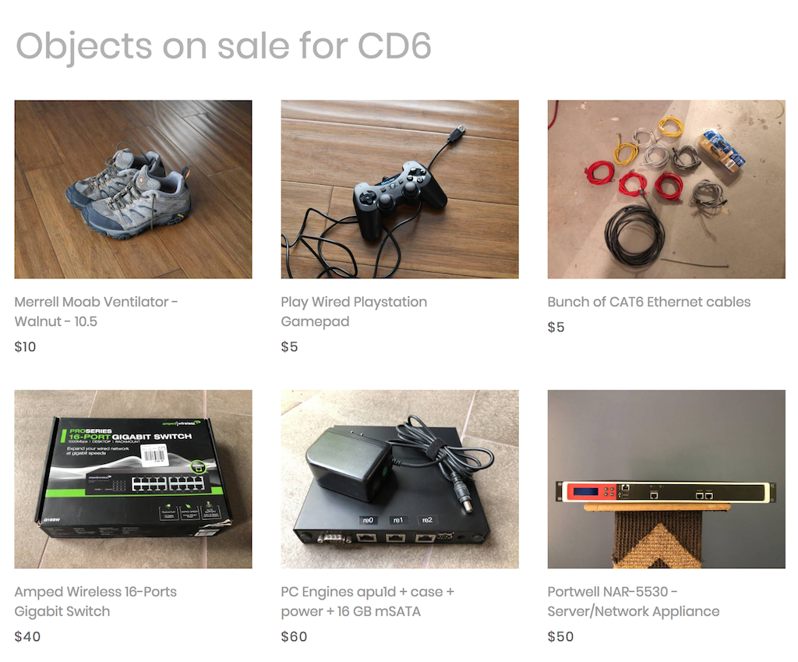

# clindex - Generate an independent static Craigslist listing

This small tool was built to generate a static site with all your active craigslist listings.  This was particularly useful for me as I was selling a large amount of items and would prefer buyers to pick up multiple things at once.

## How to use it
Create a virtualenv, install the dependencies, create a configuration file and run it:
```
$ virtualenv venv
$ . ./venv/activate
$ pip install -r requirements.txt
$ cp config.ini.example config.ini
$ vim config.ini
$ ./clindex config.ini
```

This will generate an index.html file from the index.jinja file in the `template` folder.

## Template
The template was modified from the "Coza Store" template by https://colorlib.com and I did not make any attempt to make it lean or clean it up, I just wrote the code slapped a README on it and pushed it on Github in case someone had the same issue.

## Hosting
One of the many ways to host a static website is Amazon S3:
```
$ pip install awscli
$ aws s3 sync template s3://your-bucket --acl public-read
```

## Example

